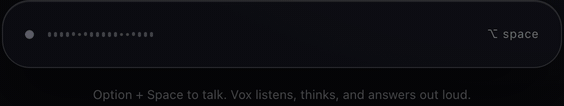

# Vox

A floating voice pill for macOS that lets you talk to your [Conductor](https://conductor.build) worktrees instead of alt-tabbing between them.

<p align="center">
  
</p>

## What it does

Vox sits at the bottom of your screen as a small always-on-top bar. Hit **Option+Space**, talk, and it answers out loud — using a local LLM that knows the state of every Conductor worktree you have running. On launch it reads Conductor's own database and speaks a recap: which agent is working, which is idle, which errored, and what it should look at first.

Everything runs on your machine. No cloud calls, no API keys.

## Features

- **Voice orchestrator, not a chatbot.** Vox reads Conductor's SQLite database (read-only) to know every worktree's agent, status, and last message, and uses that as grounding for every answer — it's told never to invent a project, PR, or bug that isn't in the data. Repos you've hidden in Conductor are ignored everywhere (recap, carousel, voice targeting).
- **Startup recap with a live carousel.** On launch, once the local TTS model is warm, Vox speaks a one-sentence status for each in-progress worktree (agent still working / errored / waiting on you / done and ready to test) while the pill expands into a vertical carousel of worktree cards that scrolls to whichever one is being discussed. Quiet worktrees are grouped into a single line instead of repeated one by one, phrasing rotates between runs, and the recap closes with an LLM recommendation grounded in each worktree's *original ask* — including a proposed follow-up prompt when an agent's result looks done. Option+Space skips it, and a recap button (revealed on hover, next to the gear) replays it anytime.
- **Live transcript.** What Vox says appears sentence-by-sentence as it's spoken, and the last sentence — usually the recommendation — stays readable after the voice stops.
- **Streaming replies.** Speech starts on the first complete sentence while the local LLM is still generating the rest — sentence N+1 is synthesized while sentence N plays.
- **Voice commands.** Ask Vox to launch a Claude Code agent on the active project, **send a prompt to any Conductor worktree by name** (Vox drafts the full prompt — context, task, done criteria — from your conversation), or switch which project is active.
- **100% local.** Speech-to-text via a resident Whisper (`openai-whisper`) daemon, the brain via any model already pulled in Ollama (default `qwen2.5:3b`), text-to-speech via Kokoro (English) or Piper (French), with macOS `say` as a last-resort fallback if neither is installed.
- **Bilingual, fully switchable.** French and English each get their own STT language hint, system prompt, and TTS voice. Flipping the toggle in settings restarts the speech daemons and clears the conversation so the model doesn't carry over the wrong language.
- **Native macOS pill.** Real-time desktop blur clipped to the pill's rounded corners (`window-vibrancy` + `NSVisualEffectView`), floats above fullscreen apps and every Space, animated waveform per state, and a per-letter transcript reveal so you can see what Vox heard.
- **Barge-in.** Vox's own audio playback runs through the browser's echo-cancelled mic pipeline, so you can just start talking to cut it off mid-sentence — no separate "stop" gesture needed.
- **Pronunciation dictionary.** Drop word → phonetic pairs in `~/.vox/pronunciations.json` (e.g. `{"Conductor": "conedeuctor"}`) to fix names the TTS engine mangles.
- **Settings panel** (Cmd+,): pick any locally-installed Ollama model from a live-fetched list, toggle FR/EN, see the running version, and check GitHub for a newer release.

## Requirements

- macOS 12 (Monterey) or later — built for Apple Silicon.
- [Ollama](https://ollama.com) installed and running, with at least one model pulled.
- Python 3.11+ for the speech daemons (installed into a dedicated `~/.vox/venv`, isolated from your system Python).
- [Conductor](https://conductor.build) if you want the worktree recap and voice-launched agents — Vox still runs without it, it just has nothing to recap.
- The [Claude Code CLI](https://docs.claude.com/en/docs/claude-code) (`claude`) on your `PATH` if you want Vox to launch agents by voice.

## Install

1. Download the latest `.dmg` from [Releases](https://github.com/justeozan/vox/releases).
2. Open it and drag **Vox** into Applications.
3. First launch: macOS will refuse to open it because the build is ad-hoc signed, not notarized. **Right-click Vox.app → Open**, confirm once — you only need to do this the first time.
   Or clear the quarantine flag from the terminal:
   ```bash
   xattr -dr com.apple.quarantine /Applications/Vox.app
   ```
4. Set up the local speech stack (Whisper, Kokoro, Piper) into `~/.vox/venv`:
   ```bash
   ./scripts/install.sh
   ```
5. Make sure Ollama has a model pulled:
   ```bash
   ollama pull qwen2.5:3b
   ```
6. Launch Vox. Option+Space to talk.

## Usage

| Shortcut | Action |
|---|---|
| **Option+Space** | Start/stop listening. Also interrupts Vox while it's speaking or during the startup recap. |
| **Cmd+,** | Open/close settings (model, language, version, updates). |

Hover the pill to reveal the settings gear; click it, or use the shortcut, either works.

Example things to say:

**English**
- "Launch an agent on findy to fix the failing tests."
- "Prompt the my-app worktree to add error handling to the login flow."
- "Switch to the api project."
- "What's the status on my-app?"

**Français**
- "Lance un agent sur findy pour corriger les tests qui échouent."
- "Envoie un prompt au worktree my-app pour ajouter la gestion d'erreur au login."
- "Passe sur le projet api."
- "Où en est mon-app ?"

Vox replies in one short spoken sentence — it's built to be glanceable and interruptible, not a conversation partner.

## Configuration

All config lives under `~/.vox/`:

- **`settings.json`** — model and language. Written whenever you change something in the settings panel.
  ```json
  { "model": "qwen2.5:3b", "language": "en" }
  ```
- **`projects.json`** — project name → filesystem path, used by the "switch project" voice command. Auto-created on first launch with the folder Vox was started from.
  ```json
  { "vox": "/Users/you/code/vox", "my-app": "/Users/you/code/my-app" }
  ```
- **`pronunciations.json`** — word → phonetic respelling, applied before text hits the TTS engine. Not created automatically; add it yourself.
  ```json
  { "Conductor": "conedeuctor" }
  ```

Advanced: environment variables (`VOX_MODEL`, `VOX_LANG`, `VOX_PROJECT`, `VOX_TTS`, `VOX_SAY_VOICE`, `VOX_AGENT_TIMEOUT`) override the persisted settings at launch, mainly useful for development.

## How it works

Vox is a [Tauri 2](https://v2.tauri.app) app: a Rust backend (`src-tauri/`) driving a small always-on-top webview (`renderer/index.html`) that renders the pill, captures the mic, and plays audio back — keeping playback in the browser is what makes echo-cancelled barge-in possible.

- **Speech in** — the renderer runs local voice-activity detection on the mic stream, encodes a 16kHz mono WAV, and sends it to Rust.
- **STT** — Rust hands the WAV to a long-lived Python daemon (`src-tauri/resources/vox_stt.py`) that keeps an `openai-whisper` model resident in memory and talks over a line-based stdin/stdout protocol; it falls back to the `whisper` CLI if the daemon isn't available.
- **Brain** — the transcript, plus a fresh read of your Conductor worktree state (including each session's original ask), go to Ollama's OpenAI-compatible endpoint as a streamed request with three function-call tools (`launch_agent`, `prompt_worktree`, `switch_project`). Models without native tool-calling get a JSON-object prompt fallback.
- **TTS** — reply sentences are queued into a resident Kokoro (English) or Piper (French) daemon (`vox_tts.py` / `vox_tts_piper.py`) as the LLM generates them — or macOS `say` if neither is available. The renderer plays each WAV; synthesis runs one sentence ahead of playback.
- **Conductor state** — read-only, via the system `sqlite3` CLI against Conductor's own database (`~/Library/Application Support/com.conductor.app/conductor.db`). Vox never writes to it.
- **Agents** — voice-launched tasks run as `claude --print --dangerously-skip-permissions "<task>"` in the target worktree (the active project, or any worktree resolved by name from Conductor's database), with a 10-minute default timeout (`VOX_AGENT_TIMEOUT`) and a live agent-count badge on the pill.

## Building from source

Prerequisites: Node 20+, a stable Rust toolchain, and Xcode Command Line Tools (for the macOS-only blur and window APIs).

```bash
npm install
npm run tauri dev    # run locally with hot reload
npm run tauri build  # produce a release .app bundle
```

The GitHub Actions release workflow (`.github/workflows/release.yml`) additionally builds a `.dmg` and attaches it to the release on every `v*` tag push.

## Roadmap

- Deeper multi-agent orchestration — threading the ongoing voice conversation into follow-up prompts across several agents at once.
- True auto-update — today Cmd+, only checks the latest GitHub release and opens the download page; no in-place install yet.
- Windows/Linux, maybe — the pill's native blur depends on `NSVisualEffectView`, which is macOS-only, so this isn't a near-term priority.

## License

MIT — see [LICENSE](LICENSE).
