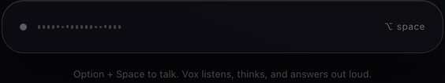

# Vox

A floating voice pill for macOS that lets you talk to your [Conductor](https://conductor.build) worktrees instead of alt-tabbing between them.

<p align="center">
  
  <br>
  <em>The loop, sped up: a spoken command launches an agent on <code>findy</code>, and Vox says so when it answers.</em>
</p>
<p align="center">
  
  <br>
  <em>The startup recap — <a href="docs/vox-demo.mp4">full mp4</a> for higher quality.</em>
</p>

## What it does

Vox sits at the bottom of your screen as a small always-on-top bar. Hit **Option+Space** and talk.

The loop it closes:

> **Launch** — *"lance un agent sur findy pour corriger les tests"* — and it goes, on any repo Conductor knows about.
> **Follow** — *"où en sont mes agents ?"* — answered from what is actually running, with elapsed time.
> **Hear back** — when an agent answers, Vox tells you out loud, summarized or word for word.
> **Ask** — *"il a dit quoi ?"* — the result stays answerable for half an hour.

On launch it reads Conductor's own database and speaks a recap: which agent is working, which is idle, which errored, and what to look at first. Everything runs on your machine by default — no cloud calls, no API keys.

Everything runs on your machine. No cloud calls, no API keys.

## Features

- **Voice orchestrator, not a chatbot.** Vox reads Conductor's SQLite database (read-only) to know every worktree's agent, status, and last message, and uses that as grounding for every answer — it's told never to invent a project, PR, or bug that isn't in the data. Repos you've hidden in Conductor are ignored everywhere (recap, carousel, voice targeting).
- **Startup recap with a live carousel.** On launch, once the local TTS model is warm, Vox speaks a one-sentence status for each in-progress worktree (agent still working / errored / waiting on you / done and ready to test) while the pill expands into a vertical carousel of worktree cards that scrolls to whichever one is being discussed. Quiet worktrees are grouped into a single line instead of repeated one by one, phrasing rotates between runs, and the recap closes with an LLM recommendation grounded in each worktree's *original ask* — including a proposed follow-up prompt when an agent's result looks done. Option+Space skips it, and a recap button (revealed on hover, next to the gear) replays it anytime.
- **Live transcript.** What Vox says appears sentence-by-sentence as it's spoken, and the last sentence — usually the recommendation — stays readable after the voice stops.
- **Streaming replies.** Speech starts on the first complete sentence while the local LLM is still generating the rest — sentence N+1 is synthesized while sentence N plays.
- **Launch an agent on any repo, as many as you want.** One `launch_agent` command targets a repo name, a worktree codename, or `"here"` for the active project — every repo Conductor knows about, not just the ones with work in progress. Names are matched exactly first, then fuzzily (so a mangled transcription still lands), and a name that matches two repos equally is a spoken question rather than a coin flip. Up to four agents run at once; ⌥Space within two seconds of a launch cancels it, and "stop" kills them all.
- **Vox tells you when an agent finishes.** As soon as an agent produces an answer — one Vox launched, or one you started inside Conductor — it speaks it: a one-sentence summary, or the answer read out verbatim, depending on a setting (long answers fall back to a summary automatically). Announcements wait for silence, never interrupt you, survive an ⌥Space (they come back rather than being lost), and the result stays in memory so you can ask "what did it say?" afterwards.
- **Local by default, your choice otherwise.** Speech-to-text via a resident Whisper (`openai-whisper`) daemon; text-to-speech via Kokoro (English) or Piper (French), with macOS `say` as a last-resort fallback. The brain — the model that turns your voice into an action — is a picker: any model pulled in Ollama (default `qwen2.5:3b`, fastest), your **Claude or Codex subscription** through their CLI with no API key, or the Anthropic / OpenAI APIs. A subscription CLI understands more but takes seconds rather than under one; the trade-off is yours.
- **Bilingual, fully switchable.** French and English each get their own STT language hint, system prompt, and TTS voice. Flipping the toggle in settings restarts the speech daemons and clears the conversation so the model doesn't carry over the wrong language.
- **Native macOS pill.** Real-time desktop blur clipped to the pill's rounded corners (`window-vibrancy` + `NSVisualEffectView`), floats above fullscreen apps and every Space, animated waveform per state, and a per-letter transcript reveal so you can see what Vox heard.
- **Barge-in.** Vox's own audio playback runs through the browser's echo-cancelled mic pipeline, so you can just start talking to cut it off mid-sentence — no separate "stop" gesture needed.
- **Pronunciation dictionary.** Drop word → phonetic pairs in `~/.vox/pronunciations.json` (e.g. `{"Conductor": "conedeuctor"}`) to fix names the TTS engine mangles.
- **Settings panel** (Cmd+,): choose the brain (provider + model, on one row — the model list follows the provider), toggle FR/EN, pick how agent answers are spoken, see the running version, and check GitHub for a newer release.

## Requirements

- macOS 12 (Monterey) or later — built for Apple Silicon.
- [Ollama](https://ollama.com) installed and running, with at least one model pulled.
- Python 3.11+ (used once to create `~/.vox/venv`; the speech stack installs itself into it, isolated from your system Python).
- [Conductor](https://conductor.build) if you want the worktree recap and voice-launched agents — Vox still runs without it, it just has nothing to recap.
- The [Claude Code CLI](https://docs.claude.com/en/docs/claude-code) (`claude`) on your `PATH` if you want Vox to launch agents by voice.

## Install

1. Download the latest `.dmg` from [Releases](https://github.com/justeozan/vox/releases).
2. Open it and drag **Vox** into Applications.
3. First launch: macOS will refuse to open it because the build is ad-hoc signed, not notarized. **Right-click Vox.app → Open**, confirm once — you only need to do this the first time.
   Or clear the quarantine flag from the terminal:
   ```bash
   xattr -dr com.apple.quarantine /Applications/Vox.app
   ```
4. Launch Vox. On first run it **detects what's missing and auto-installs the local speech stack** (Whisper, Kokoro, Piper) into `~/.vox/venv` — a small panel shows the progress. No separate setup script. You just need Python 3.11+ and an internet connection for that first install (`scripts/install.sh` still exists as a manual fallback).
5. Make sure Ollama has a model pulled:
   ```bash
   ollama pull qwen2.5:3b
   ```
6. Option+Space to talk.

## Usage

| Shortcut | Action |
|---|---|
| **Option+Space** | Start/stop listening. Also interrupts Vox while it's speaking or during the startup recap. |
| **Cmd+,** | Open/close settings (model, language, version, updates). |

Hover the pill to reveal the settings gear; click it, or use the shortcut, either works.

Example things to say:

**English**
- "Launch an agent on findy to fix the failing tests."
- "Prompt the my-app worktree to add error handling to the login flow."
- "Switch to the api project."
- "What's the status on my-app?"

**Français**
- "Lance un agent sur findy pour corriger les tests qui échouent."
- "Envoie un prompt au worktree my-app pour ajouter la gestion d'erreur au login."
- "Passe sur le projet api."
- "Où en est mon-app ?"

Vox replies in one short spoken sentence — it's built to be glanceable and interruptible, not a conversation partner.

## Configuration

All config lives under `~/.vox/`:

- **`settings.json`** — model and language. Written whenever you change something in the settings panel.
  ```json
  {
    "model": "qwen2.5:3b",
    "language": "en",
    "agent_reply": "summary",
    "agent_reply_max_chars": 420,
    "tts_engine": "auto"
  }
  ```
  `agent_reply` is `summary` (default), `verbatim`, or `off` — `off` still remembers results and still answers questions about them, it just never speaks unprompted. Verbatim switches to a summary past `agent_reply_max_chars` of cleaned text (~30 seconds of speech). `tts_engine` is `auto` (Kokoro for English, Piper for French) or an explicit `kokoro` / `piper` / `qwen3` / `say`.
- **`projects.json`** — project name → filesystem path, used by the "switch project" voice command. Auto-created on first launch with the folder Vox was started from.
  ```json
  { "vox": "/Users/you/code/vox", "my-app": "/Users/you/code/my-app" }
  ```
- **`pronunciations.json`** — word → phonetic respelling, applied before text hits the TTS engine. Not created automatically; add it yourself.
  ```json
  { "Conductor": "conedeuctor" }
  ```
  This doubles as a speech-recognition alias: if you taught the voice to *say* `orivo` as `oreevo`, Vox also accepts hearing "oreevo" and resolves it back.
- **`aliases.json`** — optional, spoken form → real name, for repos whose names Whisper mangles. Not created automatically.
  ```json
  { "orie vo": "orivo" }
  ```

Advanced: environment variables override the persisted settings at launch, mainly useful for development — `VOX_MODEL`, `VOX_LANG`, `VOX_PROJECT`, `VOX_TTS`, `VOX_SAY_VOICE`, `VOX_AGENT_TIMEOUT`, `VOX_AGENT_REPLY`, plus:

- `VOX_MAX_AGENTS` (default 4) — simultaneous agents. Each one is a full Claude Code process and they share a rate limit; past four a laptop also running Ollama and a speech model starts to crawl. Over the cap Vox refuses out loud rather than queueing silently.
- `VOX_DRAFT_MODEL` — a second local model used only to expand a spoken request into a full agent prompt. It runs *after* the spoken confirmation, so a bigger model's latency is invisible. Defaults to the main model.
- `VOX_DEBUG_SAY="…"` — drive one full turn at startup without a microphone. The mic needs a signed bundle, so this is the way to exercise the loop from `npm run tauri dev`.

Two agents in the same worktree is allowed (Vox says "that's two agents on findy now") but they can conflict on files — it's the same situation as two terminals in one directory.

## How it works

Vox is a [Tauri 2](https://v2.tauri.app) app: a Rust backend (`src-tauri/`) driving a small always-on-top webview (`renderer/index.html`) that renders the pill, captures the mic, and plays audio back — keeping playback in the browser is what makes echo-cancelled barge-in possible.

- **Speech in** — the renderer runs local voice-activity detection on the mic stream, encodes a 16kHz mono WAV, and sends it to Rust.
- **STT** — Rust hands the WAV to a long-lived Python daemon (`src-tauri/resources/vox_stt.py`) that keeps an `openai-whisper` model resident in memory and talks over a line-based stdin/stdout protocol; it falls back to the `whisper` CLI if the daemon isn't available.
- **Brain** — the transcript, plus a fresh read of your Conductor worktree state (including each session's original ask), go to Ollama's OpenAI-compatible endpoint as a streamed request with three function-call tools (`launch_agent`, `prompt_worktree`, `switch_project`). Models without native tool-calling get a JSON-object prompt fallback.
- **TTS** — reply sentences are queued into a resident Kokoro (English) or Piper (French) daemon (`vox_tts.py` / `vox_tts_piper.py`) as the LLM generates them — or macOS `say` if neither is available. The renderer plays each WAV; synthesis runs one sentence ahead of playback.
- **Conductor state** — read-only, via the system `sqlite3` CLI against Conductor's own database (`~/Library/Application Support/com.conductor.app/conductor.db`). Vox never writes to it.
- **Agents** — voice-launched tasks run as `claude --print --dangerously-skip-permissions "<task>"` in the target worktree (the active project, or any worktree resolved by name from Conductor's database), with a 10-minute default timeout (`VOX_AGENT_TIMEOUT`) and a live agent-count badge on the pill.

## Building from source

Prerequisites: Node 20+, a stable Rust toolchain, and Xcode Command Line Tools (for the macOS-only blur and window APIs).

```bash
npm install
npm run dev          # run locally (file watcher off — see .taurignore)
npm run tauri build  # produce a release .app bundle
```

The GitHub Actions release workflow (`.github/workflows/release.yml`) additionally builds a `.dmg` and attaches it to the release on every `v*` tag push.

## Evaluating a new voice

Qwen3-TTS ships as an **optional third engine**, installed from the setup panel into its own virtualenv (`~/.vox/venv-qwen`) so a failed experiment can't disturb Kokoro or Piper. Once installed, a *Voice* row appears in settings; changing it restarts the daemon and immediately speaks a sample line.

Measure before replacing anything:

```bash
python3 scripts/vox_tts_bench.py --engines piper,kokoro --langs fr --repeat 3   # baseline first
python3 scripts/vox_tts_bench.py --engines piper,kokoro,qwen3 --langs fr,en --repeat 3
```

It drives the daemons exactly as Rust does and writes `report.md` (cold start, time to first sentence, RTF, peak RSS), `bench.json`, the WAVs side by side, and `ab.html` — a blind listening test with the engine names folded away. `report.md` carries the pass/fail thresholds; the quality call is made by ear.

Baseline on an M-series Mac, French, 14 sentences × 2:

| engine | cold ms | 1st sentence | synth p95 | RTF p95 | peak RSS |
|---|---:|---:|---:|---:|---:|
| piper | 600 | 111 ms | 111 ms | 0.025 | 365 MB |
| kokoro | 4901 | 369 ms | 609 ms | 0.105 | 2158 MB |

`scripts/vox_tts_selftest.py` guards the shared text-normalisation module against regressions.

## Roadmap

- Deeper multi-agent orchestration — threading the ongoing voice conversation into follow-up prompts across several agents at once.
- True auto-update — today Cmd+, only checks the latest GitHub release and opens the download page; no in-place install yet.
- Windows/Linux, maybe — the pill's native blur depends on `NSVisualEffectView`, which is macOS-only, so this isn't a near-term priority.

## License

MIT — see [LICENSE](LICENSE).
